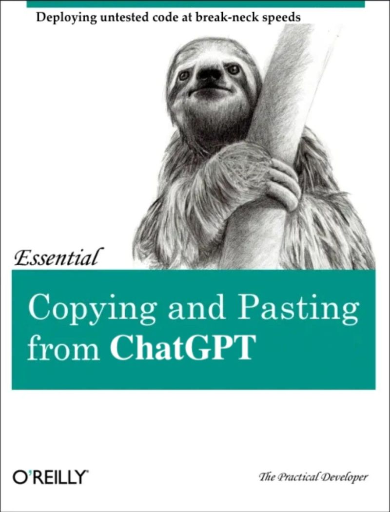

```{r setup, include=F, warning=FALSE}

 knitr::opts_chunk$set(echo = T, 
                       cache = F,
                       eval = F,    
                       message = FALSE, 
                       warning = FALSE, 
                       tidy.opts = list(width.cutoff = 60),
                       tidy = TRUE)

# default for instructor is echo = T; eval = T

# you only want to see the results for certain chunks (e.g., plots)
 
```


```{r, eval = TRUE, include = F}

# Relevant packages
pacman::p_load(babynames,
               tidyverse,
               RColorBrewer,
               Cairo,
               summarytools)

```

# Before we get started...

Tell us a little bit about why you want to learn R?

# Introducing R

::: columns
::: {.column width="50%"}
-   R is a programming language designed to perform tasks with data.
-   It is a popular tool among researchers as it provides a suite of the
    latest statistical tests.
-   It is free and open source, meaning that anyone, anywhere can use it
    (so long as they have an internet connection).
:::

::: {.column width="50%"}
-   R is undergoing continuous development, meaning that it can be used
    for almost any data task.
-   R forums, R social media (e.g., #rstats) and ChatGPT offer excellent
    support.
:::    
:::    

# Challenges

-   Learning a programming language takes time.
-   A single mistake in your code will throw an error it will not run.
-   Because of this, it is guaranteed you will become severely
    frustrated at times.
-   However, as stated, there is lots of support available.
-   Think of it like a marathon, not a 100m sprint.

---



# 5 Learning R tips

1. Make mistakes
2. Experiment and try new things
3. Find community (e.g., [edinbR on X](https://github.com/EdinbR))
4. Take. Your. Time.
5. Practice on a topic you care about.

# Course learning outcomes

1.	Develop cutting-edge R programming skills for high quality research.
2.	Apply R programming techniques to appropriately reconfigure data for analysis.
3.	Create visualisations of data trends in R.
4.	Create scripts to analyse data in R, including advanced modelling techniques (e.g., data simulation).
5.	Interpret the output of simple (e.g., linear regression) and advanced (e.g., multiple regression) statistical analyses performed in R.
6.	Compose professionally formatted research reports in R that include code chunks and text summaries.


# What are the benefits of learning a programming language?

According to @Duffany_2017

-   Pick up basic, transferable programming skills.
-   Reinforce mathematical concepts.
-   Develop your logical thinking and problem solving skills.
-   Enhance your critical thinking skills.

<p style="font-size: 20px;">Duffany, J. L. (2017). Application of Active Learning Techniques to the Teaching of Introductory Programming. IEEE Revista Iberoamericana de Tecnologias Del Aprendizaje, 12(1), 62–69. https://doi.org/10.1109/RITA.2017.2658918</p>


# What about employability?

- As @Smaldone_2022 point out, data analytic skills are becoming more desirable as companies continue to embrace developments in the digital market, e.g., data-driven decision making.
- With basic R skills, your employment prospects widen to include positions related to Data Science.
- More and more these days, companies are looking for graduates who can work with big data.
- So, my hope is to start you on your programming journey, to better equip you for the labour market of Industry 4.0.


# How the course will be delivered

-   1hr Lecture/seminar style session
-   2hr computer labs
-   Make sure you have both `R` and `RStudio` installed on your machines
    before we start.
-   These are both available for install on the HWU Software Centre app
-   `R` is the software that runs the computation, and `RStudio` is the
    front end user interface.
-   Once you have installed both of these you only need to run `RStudio`
-   My teaching philosophy focusses on practical application: the best
    way to learn R, is to code in R.


## Some things to bear in mind

::: columns
::: {.column width="50%"}
-   To perform certain operations in R we have to load different
    packages, which are kind of like toolboxes.
-   This is fairly easy, although you may have to specify the CRAN
    library.
-   If you do, set it to a UK based library (there is one in London and
    another in Bristol).
-   Packages are regularly updated, so R may need time to install
    updates from time to time.
:::

::: {.column width="50%"}
-   Packages can also cause conflicts because they use the same syntax
    -   R will notify you about this once the package is installed and
        loaded.
-   *Red text* will often be generated in the R console window
    -   Do not be afraid of this. Take your time to read it, as it does
        not always refers to a code error.
    -   Getting used to error messages or warning messages is essential
        to learning a programming language.
:::
:::

# Installing packages vs Loading packages 

```{r, eval = FALSE}

# This is what the syntax looks like to install a package
install.packages('tidyverse')

# This is what it looks like to load a package
library(tidyverse)


```

- You have to install a package in order to load it
- You only need to install a package once, so typically the install is done using a one off command in the console rather than our script (where it install every time we ran the script). 

# Cool example to whet your R appetites

- `babynames` dataset
- Full baby name data provided by the SSA. This includes all names with at least 5 uses.
- Five variables: `year`, `sex`, `name`, `n` and `prop` (n divided by total number of applicants in that year, which means proportions are of people of that gender with that name born in that year).

```{r, eval = TRUE, include=FALSE}

# Create tibble for simplicity
babynames_df <-
  babynames

```

## Explore the data a bit

The `summarytools` package is better than baseR's summary functions. 
[Have a look here for more info](https://cran.r-project.org/web/packages/summarytools/vignettes/introduction.html)

```{r}

# Summarise with the `dfSummary` function from summarytools package
dfSummary(babynames_df)

```

## On the use of packages

- Anyone using R can develop their own package.
- Some are better than others. 
- The one's I include on this course are widely used by scientists across disciplines.
- If you find other packages more suited to your data, by all means use them!


```{r}
# Wrangle a fraction of names dataset from `babynames` dataset
babynames_class <-
  babynames_df |>
  filter(name %in% c("Angela", "Chris", "Peter"))

```


# Plot proportion of names specified across dataset years

```{r, eval=TRUE}
#| echo: true
#| output-location: slide
baby_plot <-
  ggplot(babynames_class, aes(x = year, 
                      y = prop, 
                      colour = name)) +
  geom_smooth(method = "loess") +
  labs(x = "\nYear", 
       y = "Proportion\n",
       title = "Proportion of the USA population names between 1880-2017") +
  theme_minimal() 

baby_plot

```


# Lab Housekeeping

## Using directories with R

-   To reference data or media in R you need to set a working directory
-   You will also be asked to set a directory for installed packages
-   **DO NOT create a folder called 'R'**, as this is the default title R
    gives to its own namespace, which will lead to conflicts and unusual
    behaviour
-   Good practice is to create R projects in designated project folders,
    and I will show you how to do this
-   Creating an `.RProj` creates a project directory, avoiding any
    potential confusion R may experience when switching between projects

## Good practice

-   As well as teaching you how to program in R I will also be teaching
    you good practice in coding.
-   This is because I want your code to be readable to others
-   I want you to take pride in your code
-   The tidier your code, the easier it is to spot typos or to debug
    errors.
-   For ease of interpretation, I will be coding vertically (mostly)
    -   This helps identify any errors or typos and is generally easier
        to read.

## Create installation script

-   In R Studio we write scripts to perform a set of commands
-   To add a script click the Script icon below the File tab (top left)

## Working with RMarkdown

-   RMarkdown allow you to combine code chunks and plain text to produce reproducible scientific reports. 
-   RMarkdown files are edited in the *Workspace Tab* - top left window
-   Create script headings using `#` (called a "comment" or inactive
    code)
-   **To execute code chunks in RMarkdown click the play button**
-   This can be done for single lines, or multiple lines by highlighting
    sections and pressing CTRL(or CMD) + Enter
- The beauty of working in RMarkdown is that you can write text summaries around your code.    
    
## Reflections on today's reading

- https://psyteachr.github.io/quant-fun-v2/programming-basics.html 
- Give you a tour of the RStudio environment
- functions and arguments

```{r functs&args, eval=FALSE}
function_name(argument1 = value, argument2 = value)
```

- set.seed function for reproducibility    

# Additional resources

-   If you are keen to learn more about R Programming here is material
    related to both sessions

    [R for Data Science](http://r4ds.had.co.nz/) -- useful for learning
    *Tidyverse* syntax

    [The R
    Book](https://www.cs.upc.edu/~robert/teaching/estadistica/TheRBook.pdf)
    -- useful for data analysis syntax

    [ggplot2
    cheatsheet](https://www.rstudio.com/wp-content/uploads/2015/03/ggplot2-cheatsheet.pdf)
    -- useful for learning to plot with ggplot2

    [Data Wrangling and Tidying
    cheatsheet](https://www.rstudio.com/wp-content/uploads/2015/02/data-wrangling-cheatsheet.pdf)
    -- useful for wrangling and tidying syntax of the *Tidyverse*

    [R Studio
    cheatsheets](https://www.rstudio.com/resources/cheatsheets/) --
    useful guides for all things R Studio

    [Plotting means and error
    bars](http://www.cookbook-r.com/Graphs/Plotting_means_and_error_bars_(ggplot2)/)
    -- useful guide for plotting means and error bars with ggplot2
    
    
# References    
    
