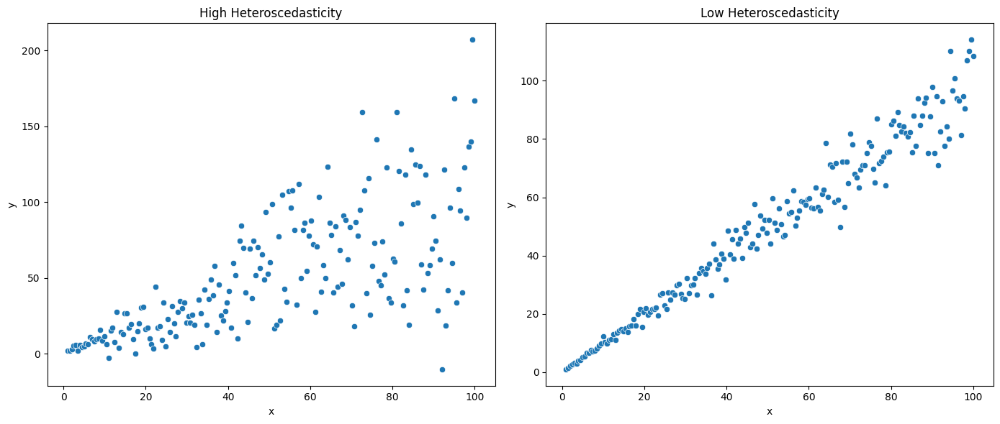

```{r setup, include=F, warning=FALSE}

 knitr::opts_chunk$set(echo = T, 
                       cache = F,
                       eval = F,    
                       message = FALSE, 
                       warning = FALSE, 
                       tidy.opts = list(width.cutoff = 60),
                       tidy = TRUE)

# default for instructor is echo = T; eval = T

# you only want to see the results for certain chunks (e.g., plots)
 
```

# Sources

- [This video on multi-level modelling](https://www.youtube.com/watch?v=hQmYzCYuD1k&t=4931s)
- [Introduction to Multilevel Modelling](https://www.learn-mlms.com/02-multiple-regression.html)
- [Introducing Linear mixed-effects models](https://psyteachr.github.io/stat-models-v1/introducing-linear-mixed-effects-models.html)


# Introduction to Multi-level modelling

# OLS regression limitations

- assumes data points are independently and identically distributed
  - i.e., subject 1's data has nothing to do with subject 2's data

- The downside of aggregating the response variable (DV) as is done in OLS regression
  - reduces the complexity of your data
  - reduces the power of your analysis
  - ignores measurement error (which may be of theoretical interest)
  - can hide where heteroscedasticity is come from


## Remind me what heteroscedasticity is...

Across all measurements there are different variances. So, across all the values of X, the variance in Y is not equal.
Often heteroscedasticity is due to indvidual differences between people. 
Multilevel models allow you to probe the nature of this heteroscedasticity. 

# Co-pilots Explanation

Heteroscedasticity is a fancy term used in statistics to describe a situation where the variability of a variable is not consistent across all levels of another variable that predicts it. 
Imagine you're looking at the relationship between people's income and their spending habits. For people with lower incomes, their spending might be pretty similar and predictable. 
But as people's incomes increase, their spending habits can vary a lot more. 
Some might save a lot, while others might spend on luxury items. 
This increasing spread or variability in spending as income rises is an example of heteroscedasticity[1](https://quickonomics.com/terms/heteroscedasticity/)[2](https://www.statisticshowto.com/heteroscedasticity-simple-definition-examples/).
In simpler terms, if you plot this data on a graph, you might see that the points spread out more as you move along the income axis, forming a sort of cone shape. This uneven spread is what we call heteroscedasticity[2](https://www.statisticshowto.com/heteroscedasticity-simple-definition-examples/).



# So, whats the alternative?

- any time you have multiple measurements of something your data is no longer independent
- MLMs also cope well with missing data
- MLMs differ to OLS as the model iterates over several possible outcomes rather than focussing solely on the one with the lowest error.
 

# Introduction to fixed and random coefficients

- Fixed coefficients:
  - intercepts and slopes are assumed to be the same across different contexts

- Random coefficients:
  - intercepts and slopes are allowed to vary across different contexts
  - can conceptualise them as "variable coefficients"

# Random coefficients

- Grouping or clustering variable(s)
  - where there is non-independence in the data
  - in social science, this might be human participants who have data measured multiple times 
  - e.g., students from different schools, where school could be used as the clustering variable; cognitive task DV, where multiple measures of the DV are collected per participant


# Gaining a deeper understanding of LMMs for research

-   Chapters 6 & 7 in from 'Learning Statistics models...' form PsyTeachR will give the necessary grounding to pursue this type of analysis without becoming overwhelmed by the formulae outlined in other texts.
-   This document gives me the opportunity to document my thoughts and learnings with the intention of then using this knowledge for the research projects currently due for analysis (e.g., Maze Study)

------------------------------------------------------------------------

# OLS Regression vs Linear mised-effects regression

Let's start by breaking down the difference between Ordinary Least Squares (OLS) regression and Linear Mixed-Effects (LME) regression in simple terms with an example, using LaTeX formatting to preserve mathematical expressions.

**Ordinary Least Squares (OLS) Regression**
OLS Regression is a simple and widely used method for predicting the value of a dependent variable based on one or more independent variables. 
The OLS method finds the line (or hyperplane in higher dimensions) that minimizes the sum of squared differences between the observed values and the values predicted by the line.

**OLS Regression Model**
The OLS regression model is given by: 

$$ y_i = \beta_0 + \beta_1 x_{i1} + \beta_2 x_{i2} + \ldots + \beta_p x_{ip} + \epsilon_i $$ 

where: 
- $y_i$ is the dependent/response variable. 
- $\beta_0$ is the intercept. 
- $\beta_1, \beta_2, \ldots, \beta_p$ are the coefficients for the independent variables. 
- $x_{i1}, x_{i2}, \ldots, x_{ip}$ are the independent variables. 
- $\epsilon_i$ is the error term.


## Remind me what a regression coefficient is

- A regression coefficient is a way to measure the relationship betweem two things. 
- Say you measure the happiness of individuals at a xmas market. Some spend a little, some a moderate amount, and others a lot.
- The regression coefficient tells you how much each person's happiness increased per each unit of money they spent. 
- If the coefficient is positive, then spending led to greater happiness, but if negative, spending led to lower happiness.
- It's worth noting that in this example, there may be a ceiling, whereby spending plateaud at a certain point, not leading to increases in happiness. 
  - The relationship between money spent and happiness is likely to be asymtotic and exponential
 - In OLS regresion with a single IV the coefficient is the same as the correlation between the predictor and response variable.  

# Linear Mixed-Effects (LME) Regression

LME Regression extends OLS regression by allowing for both fixed effects (parameters associated with the entire population) and random effects (parameters associated with individual experimental units). This is particularly useful when dealing with grouped or hierarchical data.

**LME Regression Model**

The LME regression model is given by: 

$$ y_{ij} = \beta_0 + \beta_1 x_{ij} + u_j + \epsilon_{ij} $$ 

where: 
- $y_{ij}$ is the dependent variable for observation $i$ in group $j$. 
- $\beta_0$ is the fixed intercept. 
- $\beta_1$ is the fixed coefficient for the independent variable. 
- $x_{ij}$ is the independent variable. 
- $u_j$ is the random effect for group $j$. 
- $\epsilon_{ij}$ is the error term.

### Example

Imagine you are studying the effect of study hours on test scores among students from different schools. You have data on test scores, study hours, and the school each student attends.

#### OLS Regression Example

Using OLS regression, you might model the test scores ($\text{Score}$) purely based on study hours ($\text{Hours}$):

$$ \text{Score}_i = \beta_0 + \beta_1 \text{Hours}_i + \epsilon_i $$

This model assumes that the relationship between study hours and test scores is the same for all students, regardless of which school they attend.

#### LME Regression Example

Using LME regression, you can account for the fact that students are grouped within different schools. Here, $u_j$ represents the random effect for each school $j$:

$$ \text{Score}_{ij} = \beta_0 + \beta_1 \text{Hours}_{ij} + u_j + \epsilon_{ij} $$

This model allows the intercept (and potentially the slope) to vary by school, acknowledging that different schools might have different baseline test scores or that the effect of study hours might differ by school.

### Summary

-   **OLS Regression**: Assumes a single relationship between the independent and dependent variables across all observations.
-   **LME Regression**: Allows for different relationships (random effects) within subgroups of data, making it more flexible for hierarchical or grouped data.

By understanding these differences, you can choose the appropriate model for your data, especially when dealing with complex datasets that have natural groupings.

------------------------------------------------------------------------

# Chapter 5: Introducing linear mixed-effects models

-   The worked examples in this chapter will examine the sleepstudy data
-   Data is multilevel due to repeated measurements on the same DV (mean RT) for the same participants over 10 days.

## Data context

-   18 participants from the three-hour sleep condition
-   every day for 10 days participants performance a 10 mins psycho-motor vigilance test (e.g., response to stim on screen quickly as possible)
-   DV = ppts mean RT on the task for that day

```{r}

# single participant for example
just_308 <- sleepstudy |>
  filter(Subject == "308")

# plot data
ggplot(just_308, aes(x = Days, y = Reaction)) +
  geom_point() +
  scale_x_continuous(breaks = 0:9)

# plot for every participant
ggplot(sleepstudy,
       aes(x = Days, y = Reaction)) +
  geom_point() +
  scale_x_continuous(breaks = 0:9) +
  facet_wrap(~Subject)

```

# Experimental design

-   first 3 days were adaptation (T1, T2, B), training (T1, T2), and baseline (B) in bed from 2300 to 0700
-   Day 3, baseline measures B were taken
-   From 4th to last day participants placed into one of four sleep conditions: 9hr, 7hr, 5hr, 3hr
-   7 nights sleep restriction, first occurring after 3rd day
-   days 1 and 2 coded as 0, 1; comprised adaptation and training
-   The day coded as 2, when baseline measures were taken, is the start point for analysis

## Update the data

-   Remove observations where Days is coded 0 or 1
-   make the new variable days deprived from Days variable so that the sequence starts at day 2, with day 2 being recorded as day 0, day 3 as day 1 etc.
-   store new table as `sleep2`

```{r}

# modify the data
sleep2 <-
  sleepstudy |>
  filter(Days %in% c(2:9)) |>
  mutate(days_deprived = Days - 2)

glimpse(sleep2)

# Check days and days_deprived
sleep2 |>
  count(days_deprived,
        Days)

```

## Re-plot the data

```{r}

ggplot(sleep2, aes(x = days_deprived, 
                   y = Reaction)) +
  geom_point() +
  scale_x_continuous(breaks = 0:7) +
  facet_wrap(~Subject) +
  labs(y = "Reaction Time", 
       x = "Days deprived of sleep (0 = baseline)")


```

-   It looks like deprivation caused a delay in RT other than for subject 335, so the effect is fairly consistent

# Complete pooling: One size fits all

-   estimates a single intercept and a slope for the entire dataset, ignoring the fact the participants vary in their intercepts and slopes
-   Fitting a single line is what we call "complete pooling", and the GLM formula for it is as follows:

$$
Y_{sd} = \beta_{0} + \beta_{1}X_{sd} + e_{sd} \\
e_{sd} \sim N(0,\sigma^{2})
$$

-   $Y_{sd}$ = mean RT for subject $s$ on day $d_{\imath}X_{sd}$
-   $e_{sd}$ = error

## Complete pooling model

```{r}

cp_model <- 
  lm(Reaction ~ days_deprived, sleep2)

summary(cp_model)

```

-   mean RT on Day0 is about 268ms
-   increase of 11ms per day on average
-   SE of coefficients not reliable as as we assume all observations are independent (technically, that the residuals are)

## Adding model predictions to graph

```{r}

# model coefficients
coef(cp_model)

# plot prediction
ggplot(sleep2, aes(x = days_deprived, y = Reaction)) +
  geom_abline(intercept = coef(cp_model)[1],
              slope = coef(cp_model)[2],
              color = 'blue') +
  geom_point() +
  scale_x_continuous(breaks = 0:7) +
  facet_wrap(~Subject) +
  labs(y = "Reaction Time", x = "Days deprived of sleep (0 = baseline)")

```

-   You can see that the model does not fit the data well

# No pooling approach

-   another approach could be to fit separate lines per participant
-   this means that the estimates for each participant will be completely uninformed by the estimates for the other participants, estimating 18 separate intercept/slopes pairs
-   This model could be implemented in 2 ways: 1) regression per participant; and 2) running fixed-effects regression
-   To do the latter, we need to dummy code for the `Subject` factor
-   As there are 18 ppts we'll need 17 dummy codes for the factor `Subject`; R does this when we add it as a predictor variable
-   We also need to interact `days-deprived` with `Subject` to allow intercepts and slopes to vary
-   Check `subject` is nominal before proceeding with analysis

```{r}

# check subject is a factor
sleep2 |>
  pull(Subject) |>
  is.factor()

glimpse(sleep2)

```

## No pooling model

```{r}

np_model <- 
  lm(Reaction ~ days_deprived + 
                 Subject + 
                 days_deprived:Subject,
               data = sleep2)

summary(np_model)

```

-   subject 308 is the baseline as it is the smaller number in numeric order
-   if you want to calculate the slope for the baseline it is given by the coefficient for days_deprived
-   to calculate the intercept for each subject (other than baseline), add their coefficient to the intercept (baseline)
-   to calculate the slope add the coefficient for days_deprived to their respective participant interaction (e.g., days_deprived + days_deprived:Subject372)

### Summary

-   in the 'no pooling' model `(Intercept)` and `days_deprived` are estimates of intercept and slope for subject 308, which was arbitrarily chosen as the baseline subject
-   to get population estimates you could introduce a second state to the analysis, in which you calculate means of the individual intercepts and slopes.
-   Let's use the model estimates to calculate the intercepts and slopes for each subject

```{r}

all_intercepts <- 
  c(coef(np_model)["(Intercept)"],
                    coef(np_model)[3:19] + 
      coef(np_model)["(Intercept)"])

all_slopes  <- 
  c(coef(np_model)["days_deprived"],
                 coef(np_model)[20:36] + 
      coef(np_model)["days_deprived"])

ids <- 
  sleep2 |> 
  pull(Subject) |> 
  levels() |> 
  factor()

# make a tibble with the data extracted above
np_coef <- tibble(Subject = ids,
                  intercept = all_intercepts,
                  slope = all_slopes)

np_coef

```

## Plot to check the fit of the model

```{r}

ggplot(sleep2, aes(x = days_deprived, y = Reaction)) +
  geom_abline(data = np_coef,
              mapping = aes(intercept = intercept,
                            slope = slope),
              color = 'blue') +
  geom_point() +
  scale_x_continuous(breaks = 0:7) +
  facet_wrap(~Subject) +
  labs(y = "Reaction Time", x = "Days deprived of sleep (0 = baseline)")

```

-   The outcome is much better than complete pooling,
-   We can test the $H_{0}$ that the fixed slope is zero using a one-sample test

```{r}

np_coef |>
  pull(slope) |>
  t.test()

```

# Partial pooling using mixed-effects models

-   Complete nor no-pooling is satisfactory
-   Can't generalise findings to the population
-   A random factor is a factor whose levels are considered to represent a proper subset of all levels in the population
-   Usually, you treat a factor as random when the levels you have in the data are the result of sampling, and you want to generalise beyond those levels
    -   In this case, we have 18 unique Subjects and therefore, 18 levels of the Subject factor, and want to say something general about the effects of sleep deprivation on the population of potential subjects
-   One way to do the above is to use linear mixed-effects modelling

## Linear mixed-effects modelling

-   With LMMs estimates at each level of the factor (e.g., each subject in the example above) become informed by information at other levels (i.e., for other subjects)
-   So, rather than estimate an intercept and slope per participant in isolation, the model estimates values for the population, and pulls the estimates for individual subjects towards those values, a statistical phenomenon known as **shrinkage**

------------------------------------------------------------------------

### Shrinkage explained

Shrinkage in statistics refers to the process of pulling extreme estimates towards a central value, typically the overall mean, to improve the accuracy and reliability of the estimates. This is often used in the context of regression models and other statistical methods to prevent overfitting and improve the generalization of the model to new data.

**Simple Explanation**

Imagine you have a group of students, and you want to predict their future test scores based on their past performance. Some students might have performed extremely well, while others performed poorly. If you predict their future scores solely based on their past scores, you might end up with very high or very low predictions that are not realistic.

Shrinkage techniques adjust these extreme predictions by pulling them closer to the average prediction. This way, your predictions become more moderate and generally more accurate for new, unseen data.

**Example**

1.  **Without Shrinkage**: If a student scored exceptionally high on one test, you might predict they will always score that high.
2.  **With Shrinkage**: Instead of predicting they will always score extremely high, you adjust their predicted future score slightly downward towards the average score of all students. Conversely, you adjust very low scores slightly upward.

**Why Use Shrinkage?**

-   **Reduces Overfitting**: By not relying too heavily on extreme values, your model becomes less likely to fit the noise in the data.
-   **Improves Predictions**: Predictions are more stable and reliable for new data because they are less influenced by outliers.
-   **Better Generalization**: The model can better generalize to new data because it focuses on the central tendency of the data rather than extreme cases.

**Common Methods That Involve Shrinkage**

-   **Ridge Regression**: Adds a penalty to the size of the coefficients to shrink them towards zero.
-   **Lasso Regression**: Similar to ridge regression but can shrink some coefficients to exactly zero, effectively selecting a simpler model.
-   **Hierarchical/Bayesian Models**: Use prior distributions to shrink estimates towards a common mean.

In summary, shrinkage helps to prevent extreme estimates by pulling them closer to a central value, thereby improving the model's performance and reliability.

------------------------------------------------------------------------

-   Below I present the multi-level model

### Level 1:

$Y_{sd} = \beta_{0s} + \beta_{1s}X_{sd} + e_{sd}$

-   This part of the model represents the relationship between the predictors and response variable.

-   It captures the functional form of the main relationship between reaction time $Y_{sd}$ and sleep deprivation $X_{sd}$: a straight line with the intercept $\beta_{0s}$ and slope $\beta_{1s}$.

-   Whilst this model might look like the complete pooling model, we're not estimating these values directly, but instead deriving them from the equations at level 2.

### Level 2:

$$
\beta_{0s} = \gamma_{0} + S_{0s} \\
\beta_{1s} = \gamma_{1} + S_{1s}
$$

-   These equations represent the relationships at participant level.
-   The intercept $\beta_{0s}$ is defined in terms of a fixed effect $\gamma_{0}$ and a *random intercept* $S_{0s}$.
-   Similarly, we define the slope $\beta_{1s}$ in terms of a fixed slope $\gamma_{1}$ and *random slope* $S_{1s}$.

### Variance Components

$\langle S_{0s}, S_{1s} \rangle \sim N(\langle 0,0 \rangle, \textstyle \sum)$

$$\textstyle \sum = \begin{pmatrix}
\tau_{00}{^2} & \rho\tau_{00}\tau_{11} \\
\rho\tau_{00}\tau_{11} & \tau_{11}^{2}
\end{pmatrix}
$$

$e_{sd} \sim N(0, \sigma^2)$

-   This final equation shows the variance components of the model.

## Reference table

| Variable          | Type     | Description                                               |
|------------------------|-----------------|-------------------------------|
| $Y_{sd}$          | observed | Value of reaction for subject $s$ on day $d$              |
| $X_{sd}$          | observed | Value of `days_deprived` (0-7) for subject $s$ on day $d$ |
| $\beta_{0s}$      | derived  | level 1 intercept parameter                               |
| $\beta_{1s}$      | derived  | level 1 slope parameter                                   |
| $e_{sd}$          | derived  | error for subject $s$, day $d$                            |
| $\gamma_{0}$      | fixed    | Grand intercept ("gamma")                                 |
| $\gamma_{1}$      | fixed    | Grand slope ("gamma")                                     |
| $S_{0s}$          | derived  | Random intercept (offset) for subject $s$                 |
| $S_{1s}$          | derived  | Random slope (offset) for subject $s$                     |
| $\textstyle \sum$ | random   | Variance-covariance matrix                                |
| $\tau_{00}{^2}$   | random   | Variance of random intercepts                             |
| $\rho$            | random   | Random correlations between intercepts and slopes         |
| $\tau_{11}{^2}$   | random   | Variance of random slopes                                 |
| $\sigma^{2}$      | random   | Error variance                                            |

### Exploring the multilevel model

-   If you sub Level 2 equations into Level 1 you see the advantages of representing things in the multilevel way

$Y_{sd} = \gamma{_0} + S_{0s} + (\gamma_{1} + S_{1s})X_{sd} + e_{sd}$

-   In this combined formula syntax its harder to determine the straight line form as shown in the multilevel format.
-   The multilevel format also makes it easier to see which terms go with the intercept and those with the slope.
-   Adding extra conditions could also make things even harder to interpret.

#### Fixed effects

-   Fixed effects parameters $\gamma_{0}$ and $\gamma_{1}$ are estimated from the data and reflect stable properties of the population. You can think of them as representing the average intercept and slope
-   They are "fixed" in the sense that we assume that they reflect the true underlying values in the population; they are not assumed to vary from sample to sample
-   Fixed effect parameters are often of prime theoretical interest as we want to measure their SE in a manner than is as unbiased and precise as the data allow. They are often treated as hypothesis variables in true experiments

#### Random effects

-   Random effects like $S_{0i}$ and $S_{1i}$ allow intercepts and slopes (respectively) to vary over subjects.
-   These random effects are *offsets*: deviations from the population 'grand mean' values.
-   In the `sleepstudy` data some ppts will be slower responders to others, such that they have a higher intercept (mean RT) on day 0 than the populations estimated value $\hat{\gamma}_{0}$. Slower than average ppts will have a positive $S_{0i}$ values; faster than average ppts will have negative $S_{0i}$.
-   Likewise, some ppts will show stronger effects of sleep deprivation (steeper slope) than the estimated population effect $\hat{\gamma}_{1}$, implying a positive offset $S_{1s}$, whilst others may show weaker or null effects.

#### Conceptualising participant data

-   Each participant can be represented by a vector pair $\langle S_{0i}, S_{1i} \rangle$.
-   In recognition that we are sampling participants, we treat them as a random factor rather than a fixed factor.
-   So, instead of estimating the the values for the subjects we happened to pick, we will estimate the **covariance matrix that represents the bivariate distribution from which these pairs of values are drawn**.
-   In doing so, we allow subjects in the sample to inform us about characteristics about the population.

## The Variance-covarianc matrix

$$\langle S_{0s}, S_{1s} \rangle \sim N(\langle 0,0 \rangle, \textstyle \sum) \\
\textstyle \sum = \begin{pmatrix}
\tau_{00}{^2} & \rho\tau_{00}\tau_{11} \\
\rho\tau_{00}\tau_{11} & \tau_{11}{^2}
\end{pmatrix}
$$

-   The first equation states our assumption that the random intercept/random slope pairs $\langle S_{0s}, S_{1s} \rangle$ are drawn from a bivariate normal distribution centred at the origin $\langle 0,0 \rangle$ with variance covariance matrix $\textstyle \sum$.

### Normal bivairate distribution

```{r echo=FALSE}

# Set mean vector and covariance matrix
mean_vector <- 
  c(0, 0)
cov_matrix <- 
  matrix(c(1, 0.5, 0.5, 1), 
         nrow = 2)

# Generate bivariate normal samples
samples <- 
  mvrnorm(n = 1000, 
          mu = mean_vector, 
          Sigma = cov_matrix)

# Convert samples to a data frame
samples_df <- 
  data.frame(x = samples[,1], 
             y = samples[,2])

# Plot the bivariate normal distribution
ggplot(samples_df, aes(x = x, y = y)) +
  geom_point(alpha = 0.5) +
  stat_density_2d(aes(fill = ..level..), geom = "polygon") +
  scale_fill_viridis_c() +
  theme_minimal() +
  labs(title = "Bivariate Normal Distribution",
       x = "X-axis",
       y = "Y-axis")

```

-   The variance-covariance matrix determine the probability of drawing random effect pairs $\langle S_{0s}, S_{1s} \rangle$ from the population.
-   In the covariance matrix there are an equal number of columns and rows; i.e., it's always square.
-   On the main diagonal (upper-left and bottom-right) it has the random effect variances $\tau_{00}{^2}$ and $\tau_{11}{^2}$.
-   $\tau_{00}{^2}$ = is the random intercept variance, which captures how much subjects vary in their mean response time on Day 0, before any sleep deprivation.
-   $\tau_{11}{^2}$ = is the random slope variance, which captures how much subjects vary in their susceptibility to the effects of sleep deprivation.
-   The cells in the of-diagonal contain covariances, and this information is repeated redundantly in the matrix (lower left cell is the same as upper right). Both capture the covariance between random intercepts and slopes, as expressed by $\rho\tau_{00}\tau_{11}$, where $\rho$ is the correlation between the intercept and slope.
-   So, all the information in the matrix can be captured by just three parameters, $\tau_{00}$, $\tau_{11}$, and $\rho$

# Estimating model parameters

-   going to use `lmer()` function from lme4 package
-   the general format of the model formula for N fixed effects (`fix`) and K random effects (`ran`) is

`DV ~ fix1 + fix2 + ... + fixN + (ran1 + ran2 + ... + ranK | random_factor1)`

-   Interactions between factors A and B can be specified using either `A * B` (interaction and main effects) or `A:B` (just the interaction).
-   When adding random effects into the parenthesis of the model, you should think about their addition in terms of providing `lmer()` **instructions on how to construct variance-covariance matrices**.
-   On the left side of the `|` you put the effects you want to allow to vary over the levels of the random factor named on the right side.
-   Typically, the right-side variable is one whose values uniquely identify individual subjects.

## Possible model formulas for `sleep2` data and variance-covariances matrices they construct

| Variable                         | Type                                                       |
|---------------------------------------------|---------------------------|
| 1\. random intercepts only       | `Reaction ~ days_deprived + (1 | Subject)`                 |
| 2\. random intercepts and slopes | `Reaction ~ days_deprived + (days_deprived | Subject)`     |
| 3\. random slopes only           | `Reaction ~ days_deprived + (0 + days_deprived | Subject)` |
| 4\. model 2 + zero covariances   | `Reaction ~ days_deprived + (days_deprived || Subject)`    |

### Model 1

$$
\textstyle \sum = \begin{pmatrix}
\tau_{00}{^2} & 0 \\
0 & 0
\end{pmatrix}
$$

### Model 2

$$
\textstyle \sum = \begin{pmatrix}
\tau_{00}{^2} & \rho\tau_{00}\tau_{11} \\
\rho\tau_{00}\tau_{11} & \tau_{11}{^2}
\end{pmatrix}
$$

### Model 3

$$
\textstyle \sum = \begin{pmatrix}
0 & 0 \\
0 & \tau_{11}{^2}
\end{pmatrix}
$$

### Model 4

$$
\textstyle \sum = \begin{pmatrix}
\tau_{00}{^2} & 0 \\
0 & \tau_{11}{^2}
\end{pmatrix}
$$

# Fitting Model 2 (most reasonable given the data)

```{r}

pp_mod <- lmer(Reaction ~ days_deprived + (days_deprived | Subject), sleep2)

summary(pp_mod)

```

-   Before moving onto the interpretation, let's plot the model against the data
-   We generate model predictions using the `predict()` function (see `?predict.merMod` for information about use with mixed-effects models)

## Plotting the new model

-   First, let's create a new df with predictor values for `Subject` and `days_deprived`

```{r}

newdata <-
  crossing(Subject = sleep2 |> 
             pull(Subject) |> 
             levels() |> factor(),
           days_deprived = 0:7)

head(newdata)

```

-   Now take this new dataset and run it through `predict()`. Usually, add this as a new vector to preserve raw responses

```{r}

# add predicted values using lmer model
newdata2 <-
  newdata |>
  mutate(Reaction = predict(pp_mod, newdata))

```

-   And finally, lets plot the data.

```{r}
ggplot(sleep2, aes(x = days_deprived, y = Reaction)) +
  geom_line(data = newdata2,
            color = 'blue') +
  geom_point() +
  scale_x_continuous(breaks = 0:7) +
  facet_wrap(~Subject) +
  labs(y = "Reaction Time", x = "Days deprived of sleep (0 = baseline)")

```

# Interpreting `lmer()` output and extracting estaimtes

-   `lmer()` returns a model of class "lmerMod".

## Fixed effects

```{r}

## Fixed effects:
##               Estimate Std. Error t value
## (Intercept)    267.967      8.266  32.418
## days_deprived   11.435      1.845   6.197

```

-   estimated mean RT for participants at Day 0 was 268 miliseconds
-   each day of sleep deprivation added 11 miliseconds to RT, on average
-   you could use the argument `fixedef(pp_mod)` to extract the fixed effects in isolation
-   the `Std. Error` gives the estimates of the variability for these parameters due to sampling error. You could use these to calculate the $t$-values, or to derive confidence intervals.
-   Let's extract them using `vcov(pp_mod)` to generate the variance-covariance matrix (not the one associated with the random effects), pull out the diagnoal using `diag()` and then take the square root using `sqrt()`

```{r}

# Calculate t-values
vcov(pp_mod) |>
  diag() |> 
  sqrt()

```

-   Note that these $t$-values do not appear with $p$-values, but there are ways to derive these
-   The $t$-values also do not appear with degrees of freedom because degrees of freedom in a mixed-effects model are poorly defined. Often, people treat them as Wald $z$ values, i.e., as observations from the standard normal distribution.
-   Because the $t$ distribution asymptotes the standard normal distribution as the number of observations goes to infinity, this "t-as-z" practice is legitimate if you have a large enough set of observations.

### Calculating Wald z values

-   To calculate the Wald $z$ values, just divide the fixed effect estimate by its standard error:

```{r}

tvals <-
  fixef(pp_mod) / sqrt(diag(vcov(pp_mod)))

tvals

```

-   And, you can calculate the associated $p$-values using the following formula:

```{r}
2 * (1 - pnorm(abs(tvals)))
```

-   This indicates that we can reject $H_{0} : \gamma_{1} = 0$; i.e., sleep deprivation does appear to increase response time.

### Extract Confidence intervals

-   You can get confidence intervals for the estimates using `confint()`
-   This technique uses the *parametric bootstrap*

```{r}

confint(pp_mod)

```

## Random effects

```{r}
## Random effects:
##  Groups   Name          Variance Std.Dev. Corr
##  Subject  (Intercept)   958.35   30.957       
##           days_deprived  45.78    6.766   0.18
##  Residual               651.60   25.526       
## Number of obs: 144, groups:  Subject, 18

```

-   This table contains information about the variance components: the variance coveriance matrix (or matrices, if you have multiple random factors) and the residual variance.
-   `Residual` = tells use the residual variance $\sigma^{2}$ was estiamted at about 651.6. The value in the next column is the SD $\sigma$ = 25.53, or the root of the variance
-   You can extract the residual SD using the `sigma()` function

```{r}

sigma(pp_mod)

```

-   The two lines above `Residual` give us information about the variance-covariance matrix for the `Subject` random factor

```{r}
##  Groups   Name          Variance Std.Dev. Corr
##  Subject  (Intercept)   958.35   30.957       
##           days_deprived  45.78    6.766   0.18
```

-   Values in the `Variance` column give us the main diagnoal of the matrix, and the `Std.dev` values are just the associated square root
-   The `Corr` column tells us the correlation between the intercept and slope.
-   We can extract these values from the fitted object `pp_mod` using `VarCorr()`. This returns a named list, with one element for each random factor.
-   `Subject` is our only random factor, so the list will be of length 1

```{r}

# variance-covariance matrix for random factor Subject
VarCorr(pp_mod)[["Subject"]] # equivalently: VarCorr(pp_mod)[[1]]

```

-   First few lines are the variance-covariance matrix.
-   You can extract the variances from the main diagonal as we have been using `diag()`

```{r}
diag(VarCorr(pp_mod)[["Subject"]]) # just the variances

```

-   You can also extract the correlation by extracting `"correlation"` attribute then pilling out the elements in row 1, column 2 (`[1, 2]`):

```{r}
attr(VarCorr(pp_mod)[["Subject"]], "correlation")[1, 2] # the correlation

```

-   We can also pull lout the esimtated random effects (BLUPS) using `ranef()`. Like `VarCorr()`, the result is a named list, with each elements coresponding to a single random factor:

```{r}
ranef(pp_mod)[["Subject"]]
```

-   We can get fited values from the model using `fitted()` and the residuals using the `residuals()`. These functions take into accoun the "conditional modes of the random effects", i.e., the BLUPS

```{r}
mutate(sleep2,
       fit = fitted(pp_mod),
       resid = residuals(pp_mod)) |>
  group_by(Subject) |>
  slice(c(1,10)) |>
  print(n = +Inf)
```

-   Finally, we can get predictions for new data using `predict()` as previously done.
-   In this case, we are using `predict()` to imagine what might have happened had we continued our study for **three extra days**

```{r}

## create the table with new predictor values
ndat <- crossing(Subject = sleep2 %>% pull(Subject) %>% levels() %>% factor(),
                 days_deprived = 8:10) %>%
  mutate(Reaction = predict(pp_mod, newdata = .))

## NOTE: After thorough invstigation the above code does not run using the new pipe "|>"


```

### Plot the predicted data

```{r}
ggplot(sleep2, aes(x = days_deprived, y = Reaction)) +
  geom_line(data = bind_rows(newdata2, ndat),
            color = 'blue') +
  geom_point() +
  scale_x_continuous(breaks = 0:10) +
  facet_wrap(~Subject) +
  labs(y = "Reaction Time", x = "Days deprived of sleep (0 = baseline)")
```

# Linear mixed-effects models with one random factor

-   When deciding which type of model to use for your analysis you should ask the following questions:
    -   What type of data does the dependent variable represent and how is it distributed?
    -   Is the data multi-level or single level?

| test                       | conventional approach | regression approach     |
|----------------------------|-----------------------|-------------------------|
| one-sample t-test          | `t.test(y, mu = c)`   | `lm(y ~ 1, offset = c)` |
| independent samples t-test | `t.test(x, y)`        | `lm(y ~ x)`             |
| one factor ANOVA           | `aov(y ~ x)`          | `lm(y ~ x)`             |
| factorial ANOVA            | `aov(y ~ a * b)`      | `lm(y ~ a * b)`         |

-   All of the above are between-subjects designs without repeated measures.
-   Note that in the factorial case, we would replace `a` and `b` with our own deviation-coded numerical predictors, for reasons discussed in the interactions chapter.
- Mixed effects models are most relevant to multi-level data. Multilevel data are those that:
  + have a within-subjects factor, and/or
  + have pseudo-replications, and/or
  + have multiple stimulus items
  
### Pseudoreplications

- Pseudo-replications occur when you take multiple measurements within the same condition; e.g., multiple trials per condition in a cognitive test
- You cannot use conventional t-test when you have pseudo-replications (or multiple stimuli) in your data, but instead you must take calculate the means and compare those. 
- The problem is that when you aggregate data like this you throw away potentially important variability that could hold theoretical significance
- There are two difference sources of variability worth considering underneath the means:
  + trial-by-trial variability in simple RT (represented by $\sigma$)
  + variability across subjects in terms of how slow or fast they are to the population mean ($\gamma_{00}$)
- Random effect of slope in between subject conditions meaningless as the comparison does not share a baseline, like in within-subject designs


### The Random intercepts model

- random-intercepts models (without random slopes) is appropriate for between subjects (or "one sample") data with pseudo replications
- "random-intercepts-only" also appropriate for designs with within-subjects factors, but only if **there are not pseudo-replications in the data**

### Expressing the study design and performing tests in regression 

- to recreate t-test and ANOVA style analysis with LMMs you need to:
  + learn how to express your study design in regression formula
  + learn to retrieve $p$-values for the test you perform.
- For the regression model 

$y = \beta_{0} + \beta_{1}x_{1} + \beta_{2}x_{2} + ... + \beta_{m}x_{m} + e$

You would write the model as follows

`y ~ 1 + x1 + x2 + ... + xm + (1 + x1 + ... | subject)`

- As always, the residual terms is implied, not mentioned, but the predictors are stated
- For the term in brackets `(... | ...)` the right side specifies the name of a variable ( in this case, `subject`) that codes the levels of the random factor. The left side specifies what regression coefficient you want to allow to vary over those levels
- The `1` at the start of the formula specifies that you want an intercept, which is included by default anyway, so can be dropped from the model specification
- The `1` within the brackets specifies a **random intercept** which is also included by default
- The predictor variables mentioned inside the brackets specify the **random slopes**
- For interactions you specify then using `*`, e.g., A*B


#### Three level factor example

- For interactions, it is sensible to code your own numerical predictors, particularly if your goal is to do ANOVA style tests of **main effects and interactions**, which can be difficult if any of your variables are type `factor`.
- Say you have a three-level factor `meal` with the levels `breakfast`, `lunch` and `dinner`. 
- You would create two variables `lunch_v_breakfast` and `dinner_v_breakfast` following the coding scheme below:

| **factor level** | **lunch_v_breakfast** | **dinner_v_breakfast** |
|------------------|-----------------------|------------------------|
| breakfast | -1/3 | -1/3 |
| lunch | +2/3 | -1/3 | 
| dinner | -1/3 | +2/3 |

- If your DV was calories, your model would be

`calories ~ lunch_v_breakfast + dinner_v_breakfast`


## Multiparameter testing

But what if you wanted to interact the factor `meal` with another 2-level factor, like `time_of_week` (`weekday` versus `weekend`, coded as -.5 and +.5 respectively; following **deviation coding convention**), because you think calories consumed per meal would differ across the levels of this variable?

Then the model becomes

`calories ~ (lunch_vbreakfast + dinner_v_breakfast) * time_of_week`

Brackets have been placed around the predictors associated with the two-level variable so that each one interacts with `time_of_week`. The above syntax is short for

`calories ~ lunch_v_breakfast + dinner_v_breakfast + time_of_week + lunch_v_breakfast:time_of_week + dinner_v_breakfast:time_of_week`

This is the regression way of estimating parameters for a $3 \times 2$ factorial design. 


  

