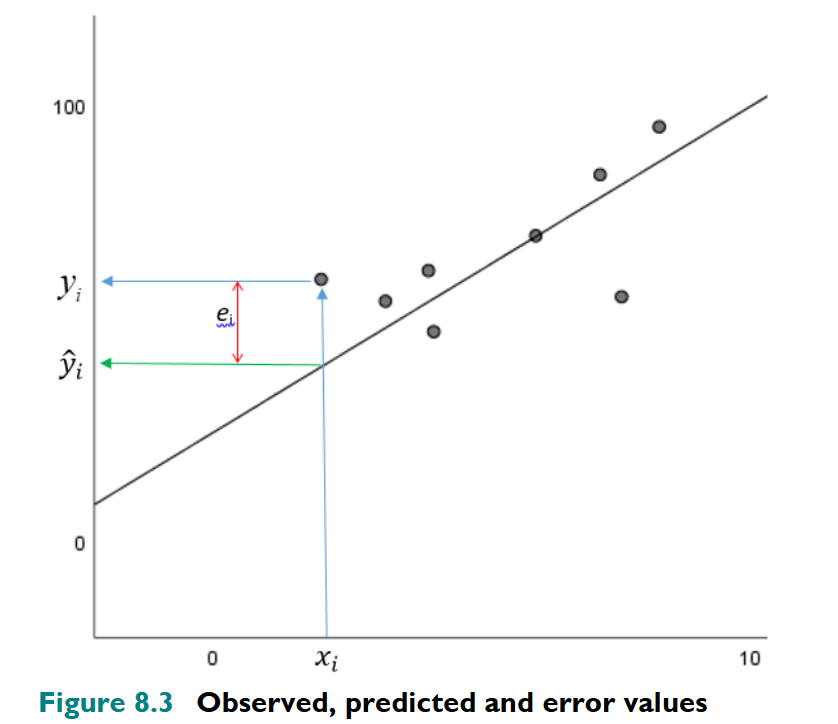
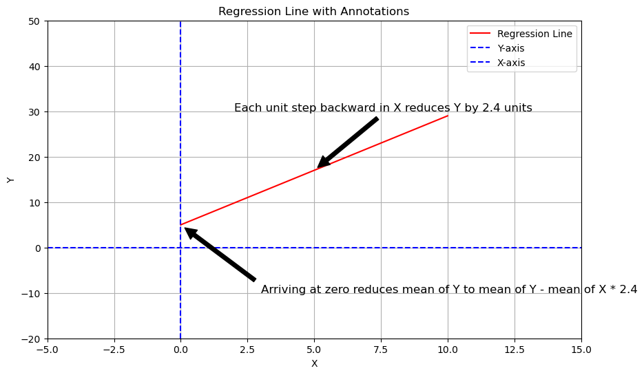

```{r setup, include=FALSE}

# markdown formatting
knitr::opts_chunk$set(echo = TRUE)

```


# Session outline

- Today, we are going to examine methods for checking how well a model fits the data
- We are going to look at a few today outlined in @Canduela_Raeside_2020
- Discuss multicollinearity and how to check for it
- On Thursday I will run a code clinic where you can ask me any questions about R, to give you some extra support as your prepare the summative assessment. 
    
<!--

# Regression Theory

-   Regression can be thought of as a process of generating a line of
    best fit given the data.
-   Rather than draw by hand, a procedure called **least squares
    regression** can be used to reliably draw this line.

## Least squares regression

The line is adjusted to minimise the SSE (sum of squared deviations; $e_{i}^{2}$) of each point from the line:

Minimise SSE =
$min \underset{i=1}{\stackrel{n}{\sum}}e_{i}^{2} = min \underset{i=1}{\stackrel{n}{\sum}}(y_{i} - \hat{y}_{i})^2$

-   $y_{i}$ = observed value
-   $\hat{y}_{i}$ = predicted value
-   $e_{i}$ = error
-   $n$ = number of observations
-   $\underset{i=1}{\stackrel{n}{\sum}}$ = summation of a sequence of terms indexed by $i$, starting from $i = 1$ and ending at $i = n$


# Illustration of regression

#{left="0" width="580" height="590"}

- So, least squares regression is summation of all of the squared differences ($e_{i}$) between the observed ($y_{i}$) and predicted ($\hat{y}_{i}$) values of $y$


# Regression formula

$$Y_i = \beta_0 + \beta_1 X_i + e_i$$

Where...

-   $y_{i}$ = $i$th observation of the dependent variable,
    $i = 1,2,...,n$
-   $x_{i}$ = $i$th observation for the independent variable,
    $i = 1,2,...n$
-   $\beta_{0}$ = intercept or constant
-   $\beta_{1}$ = the slope or gradient of the predictor/independent
    variable
-   $\epsilon_{i}$ = error or residual of the $i$th observation
-   $n$ = total number of observations

<!--
# Calculating coefficients

$\beta_{0}$ and $\beta_{1}$ are **coefficients** and can be estimated
using the following equations:

$\hat{\beta}_{1} = \frac{\underset{i=1}{\stackrel{n}{\sum}}(x_{i} - \overline{x})(y_{i} - \overline{y})}{\underset{i=1}{\stackrel{n}{\sum}}(x_{i} - \overline{x})^2}$

$\beta_{0} = \overline{y} - \hat{\beta}_{1}\overline{x}$    


# The relationship between correlation and regression?

-   Correlation tells us about the strength and relationship between two
    variables.
-   Regression (on the other hand) predicts the value of one variable
    based on the value of another variable.
-   For example, in the heights and weights data, we can use regression
    modelling to *predict someone's weight given their height*.

-->

# Reproducibility & notation

```{r}

# Set seed for reproducibility
set.seed(123)

# Change the output format
options(scipen = 999)

```


# Load packages

```{r}
# Load packages
pacman::p_load(tidyverse,
               corrr,
               tidyplots,
               car) # for VIF

```

# Data setup

```{r}

# Read in the data
handw <-
  read_csv("data_raw/heights_and_weights.csv",
           col_types = "dd")


# Add log transformed vectors to dataset
handw_log <-
  handw |>
  mutate(hlog = log(height_in),  
         wlog = log(weight_lbs))

# load grades data for VIF
grades <-
  read_csv("data_tidy/grades.csv",
           col_types = "ddii")

```

<!--

# Remind me, why are we using the log of the data?

# Raw data

```{r echo=FALSE, include=F, eval=F}
# generate the scatter plot with ggplot2
ggplot(data = handw,                                    # specify data source
       mapping = aes(x = height_in, y = weight_lbs)) +  # specify x and y axis
  geom_point(alpha = .6) +                              # modify transparency of points
  labs(x = "\nHeight (inches)",                         # supply axis label names
       y = "Weight (pounds)\n",
       title = "Raw height and weight data")
```

# Normalised data

```{r echo=FALSE, include=F, eval=F}
# generate a scatter plot of the log data
ggplot(data = handw_log,                      # don't forget to enter the new dataset              
       mapping = aes(x = hlog, y = wlog)) +  
  geom_point(alpha = .6) +                              
  labs(x = "\nLog(Height)",                           
       y = "log(Weight)\n",
       title = "log transformed height and weight data")

```


# Rationale for taking the log

-   When we take the log of the data we normalise it, to stabilise the
    variance in our vectors.
-   This is particularly useful if the data are highly skewed or show
    **heteroscedasticity**
    -   When the difference between the observed and predicted values
        (i.e., the residuals $e_i$) is not constant across all levels of
        the independent variables.
    -   For the heights and weights data, you can see that the residuals increase as the values for height and weight approach the upper limit 
-   Normalised data is more suitable for statistical analysis that
    assume normality, such as linear regression.


# Using regression to make predictions based on height and weight data

**Regression formula**

$$Y_i = \beta_0 + \beta_1 X_i + e_i$$

**In the context of predicting height from weight**

-   $Y_i$ = prediction of a person $i$'s weight

-   $X_i$ = observed height

-   $\beta_0$ = y-intercept

-   $\beta_1$ = slope parameter

-   $e_i$ = residuals

    -   Note, it is assumed that $e_i$ comes from a normal distribution
        with a mean of zero and variance $\sigma^2$.
        
<!--

# Making predictions using the available statistics

To estimate the parameters of the regression between the y-intercept
($\beta_0$) and the slope ($\beta_1$) all we need is the:

-   Mean estimates for $X$ and $Y$, denoted as $\hat{\mu_x}$ & $\hat{\mu_y}$
-   Standard deviations for $X$ and $Y$, denoted as $\hat{\sigma_x}$ &
    $\hat{\sigma_y}$
-   Correlations between $X$ and $Y$, denoted as $\hat{\rho}$
-   Note: the $\hat{hat}$ denotes an estimate of a population parameter.

So, the statistics required to estimate $\beta_0$ and $\beta_1$ are much
the same as we used for simulating correlational data.

# A reminder of our previous calculations

-   $\hat{\mu_x} = 4.11, \hat{\sigma_x} = 0.26$ (estimated mean and SD
    of log height)

-   $\hat{\mu_y} = 4.74, \hat{\sigma_y} = 0.65$ (estimated mean and SD
    of log weight)

-   $\hat{\rho_{xy}} = 0.96$ (estimated correlation between the two)

# Estimating the slope $\beta_1$

-   Let's start by estimating the value of the slope $\beta_1$.
-   Importantly, $\beta_1$ can be expressed in terms of the correlation
    coefficient $\rho$ times the ratio of the standard deviations of $Y$
    and $X$.

$$\beta_1 = \rho\frac{ \sigma_Y}{\sigma_X}$$

# Plugging in the numbers

-   Now, you can use the estimates of log height and log weight, to
    estimate the slope:

$$\beta_1 = \rho\frac{ \sigma_Y}{\sigma_X}$$

In R Code:

```{r estimate slope}

# Estimate slope using formula
b1 <- .96 * (.65 / .26)
b1 # 2.4

```

# Using the Axis to fill in the blanks: part 1

-   For mathematical reasons, the regression line is **guaranteed to go
    through the point corresponding to the mean of both $X$ and $Y$,
    i.e., the point ($\mu_x$, $\mu_y$)**.

-   One way to think about this is that the regression line pivots
    around that point depending on the slope ($\beta_1$).

-   We also know that $\beta_0$ is the y-intercept, where the line
    crosses the vertical axis at $X$ = 0.
    
    
# Regression line passing through variable means ($\mu_x$, $\mu_y$)
    
```{r, echo=FALSE, eval=F, include=F}

# data = handw_log                      
# vars: x = hlog, y = wlog 

# Fit a linear model
model <- 
  lm(wlog ~ hlog, data = handw_log)

# Get the means of log-transformed height and weight
mean_hlog <- 
  mean(handw_log$hlog)
mean_wlog <- 
  mean(handw_log$wlog)

# Create the plot
ggplot(handw_log, aes(x = hlog, 
                 y = wlog)) +
  geom_point(color = "green", 
             alpha = 0.5) +  # Scatter plot of the data points
  geom_smooth(method = "lm", 
              color = "red", 
              se = FALSE) +  # Regression line
  geom_vline(xintercept = mean_hlog, 
             linetype = "dashed", 
             color = "blue") +  # Mean of hlog
  geom_hline(yintercept = mean_wlog, 
             linetype = "dashed", 
             color = "blue") +  # Mean of wlog
  geom_point(aes(x = mean_hlog, 
                 y = mean_wlog), 
             color = "purple", size = 3) +  # Mean point
  labs(
    title = "Simple Linear Regression with Log-Transformed Data",
    subtitle = "Regression line passes through the mean of log-transformed height (4.11) and weight (4.74)",
    x = "\nLog of Height (in inches)",
    y = "Log of Weight (in lbs)\n"
  ) +
  annotate("text", 
           x = mean_hlog, 
           y = mean_wlog, 
           label = "Mean (hlog, wlog)", 
           vjust = -1, color = "purple") +
  theme_minimal()

```

<!--

This code will generate a plot with:
- A scatter plot of the log-transformed data points in blue.
- A red regression line.
- Green dashed lines representing the means of log-transformed height and weight.
- A purple point at the intersection of the means of log-transformed height and weight, labeled "Mean (hlog, wlog)".

Feel free to run this code in your R environment and let me know if you need any further assistance!


This code will generate a plot with:
- A scatter plot of the data points in blue.
- A red regression line.
- Green dashed lines representing the means of X and Y.
- A purple point at the intersection of the means of X and Y, labeled "Mean (X, Y)".

Feel free to run this code in your R environment and let me know if you need any further assistance!


# Using the Axis to fill in the blanks: part 2

-   From all of this information we can calculate $\beta_0$.

-   Remember that $\beta_1$ tells you that for each change in $X$ you
    have a corresponding change of **2.4** for $Y$, and that the line
    goes through points ($\mu_x$, $\mu_y$) as well as the y-intercept
    (0, $\beta_0$).

# Re-framing the calculations

-   Think about stepping back unit-by-unit from the mean of $X = \mu_x$
    to $X = 0$.

-   At $X =\mu_x$, $Y = 4.74$, because as stated earlier, the regression
    line is guaranteed to go through the point corresponding to the mean
    of both $X$ and $Y$, i.e., the point ($\mu_x$, $\mu_y$) or (4.11,
    4.74).

-   Each unit step you take backward in the $X$ dimension, $Y$ will
    reduce by $\beta_1 = 2.4$ units.

-   When you get to zero, $Y$ will have dropped from $\mu_y$ to
    $\mu_y - \mu_x\beta_1$.
    
    
# Illustrating this relationship    

#


```{r, include=FALSE}
# data = handw_log                      
# vars: x = hlog, y = wlog 

# Fit a linear model
model <- 
  lm(wlog ~ hlog, data = handw_log)

# Get the means of log-transformed height and weight
mean_hlog <- 
  mean(handw_log$hlog)
mean_wlog <- 
  mean(handw_log$wlog)

# Create the plot
ggplot(handw_log, aes(x = hlog, 
                 y = wlog)) +
  geom_point(color = "green", 
             alpha = 0.5) +  # Scatter plot of the data points
  geom_smooth(method = "lm", 
              color = "red", 
              se = FALSE) +  # Regression line
  geom_vline(xintercept = mean_hlog, 
             linetype = "dashed", 
             color = "blue") +  # Mean of hlog
  geom_hline(yintercept = mean_wlog, 
             linetype = "dashed", 
             color = "blue") +  # Mean of wlog
  geom_point(aes(x = mean_hlog, 
                 y = mean_wlog), 
             color = "purple", size = 3) +  # Mean point
  labs(
    title = "Simple Linear Regression with Log-Transformed Data",
    subtitle = "Regression line passes through the mean of log-transformed height (4.11) and weight (4.74)",
    x = "\nLog of Height (in inches)",
    y = "Log of Weight (in lbs)\n"
  ) +
  annotate("text", 
           x = mean_hlog, 
           y = mean_wlog, 
           label = "Mean (hlog, wlog)", 
           vjust = -1, color = "purple") +
  annotate("text", 
           x = mean_hlog - 0.5, 
           y = mean_wlog - 2.4 * 0.5, 
           label = "Each unit step backward in X reduces Y by 2.4 units", 
           vjust = -1, color = "black") +  # Annotation for slope effect
  annotate("text", 
           x = 0, 
           y = mean_wlog - mean_hlog * 2.4, 
           label = "Arriving at zero reduces mean of Y to mean of Y - mean of X * 2.4", 
           vjust = -1, color = "black") +  # Annotation for mean reduction
  xlim(-5, 15) +  # Extend x-axis limits
  ylim(-20, 50) +  # Extend y-axis limits
  theme_minimal()

```    
    

# The Solution

-   With all of the above considerations taking into account the
    solution is $\beta_0 = \mu_y - \mu_x\beta_1$.

-   Using this information we can calculate the slope value:
    $\beta_0 = 4.74 - 4.11 \times 2.4 = -5.124$

-   Now we have the following statistics:

    -   $\beta_1 = 2.4$

    -   $\mu_x = 4.11$

    -   $\mu_y - 4.74$

    -   $\beta_0 = -5.124$
    

# Plugging in the numbers

So..

$$Y_i = \beta_0 + \beta_1 X_i + e_i$$
Becomes...  

$$Y_i = -5.124 + 2.4X_i + e_i$$

# Checking the results

-   To check the results, let's first run a regression on the log
    transformed data using `lm()`, which estimates parameters using
    *ordinary least squares (OLS) regression*.
-   In OLS regression, the goal is to find the line that best fits the
    data by minimizing the sum of the squared differences between the
    observed values of the dependent variable and the values predicted
    by the regression line.
-   Note, you are interested in the `Estimate` values.

```{r}
#| echo: true
#| output-location: slide
summary(lm(wlog ~ hlog,
           data = handw_log))
```

# Matching the regression output to our calculations

From the model output:

-   Estimated slope parameter $\beta_1 = 2.433$ (2.4 from our
    calculations)

-   Estimated y-intercept $\beta_0 = -5.269$ (-5.124 from our
    calculations)

-   These don't match exactly because of the rounding we've used in our
    calculations.

# Checking your regression estimate with a plot

Another way to check the accuracy of your regression calculations is to
superimpose the regression line on the scatter-plot of the log
transformed data.

```{r, eval=F, include=F}
#| echo: true
#| output-location: slide
ggplot(data = handw_log, 
       aes(hlog, wlog)) +
  geom_point(alpha = .3)+
  geom_abline(intercept = -5.124, 
              slope = 2.4, 
              colour = 'purple') +
  labs(title = "Superimposed regression line onto log transformed data",
       x = "\nlog(height)", 
       y = "log(weight)\n")
```

# Predicting someone's weight given their height

-   Say we want to predict the weight of someone who is 69inches or
    175cm (average height of a person from the US). Let's plug the log
    of this value (4.23) into our regression formula:

$Y_i = -5.124 + 2.4 \times 4.23 + e_i$

-   Note: We do not need to provide the residuals ($e_i$) as they are
    estimated from the regression equation.

$Y_i = 5.028$

$exp(5.028) = 152.63lbs = 69.2kg$

-   So, our regression model predicts that someone who is 175cm tall
    would weigh 69.2kg.

# A little more about $e_i$

-   Conventionally, $e_i$ come from a normal distribution with $\mu = 0$
    and variance $\sigma^2$.
-   $e_i$ are important for assessing the model's performance and
    diagnostic purposes but they are not necessary for making
    predictions using the regression equation.
    
# Model fit

- We did not cover how to test the model's fit today
- This is covered in the RM3 textbook, and there are good resources elsewhere
- I prioritised familiarity with the modelling process over assumption checking
    
# Roundup

- Today I have shown you how to calculate a simple regression model by hand using formula
- The aim was to unveil some of the computation that goes on behind the scene to help you understand what regression analysis is actually doing. 
- Using this method, we also made a prediction about someone's height given their weight. 
- On Monday, we are going to look at multiple regression

-->


# $R^{2}$ Coefficient of determination

- To this point we have created a regression equation and used it to
predict someone's weight given their height. 

- But, we also want to know how good a fit our equation is given the data. To calculate this we use
the ***coefficient of determination*** ($R^2$):

$R^2 = \frac{\text{Sum of Squares Explained by Regression (SSR)}}{\text{Total Sum of Squares (before regression)(TSS)}} = \frac{\underset{i=1}{\stackrel{n}{\sum}}(\hat{y}_{i} - \overline{y})^2}{\underset{i=1}{\stackrel{n}{\sum}}(y_{i} - \overline{y})^{2}}$


# Calculating the total sum of squares

- The total sum of squares (TSS) in the dependent variable (i.e., weight) is split
into two parts: 
  - the part explained by sum of squares explain by regression (SSR), which is the sum of the squared differences between the predicted values ($\hat{y}_{i}$) and the mean of the response variable ($\overline{y}$) 
  
$$\text{Sum of Squares Explained by Regression (SSR)} = \sum_{i=1}^{n} (\hat{y}_{i} - \overline{y})^2$$
  
  
  - the part that is unexplained sum of squared errors (SSE), which is the squared difference between the observed values ($y_{i}$) and the predicted values ($\hat{y}_{i}$), since the relationship is never perfect and there are always some residuals.
  
$$\text{Sum of Squares Errors (SSE)} = \sum_{i=1}^{n} (y_{i} - \overline{y})^2$$  
  
# Where the $R^2$ values come from
  
{left="0" width="580" height="590"}


# $R^{2}$ Thresholds

$R^2 = \frac{\text{Sum of Squares Explained by Regression (SSR)}}{\text{Total Sum of Squares (before regression)(TSS)}} = \frac{\underset{i=1}{\stackrel{n}{\sum}}(\hat{y}_{i} - \overline{y})^2}{\underset{i=1}{\stackrel{n}{\sum}}(y_{i} - \overline{y})^{2}}$

- The coefficient of determination can take values between 0 and 1, but is
commonly reported as a percentage, as it represent the proportion of the
variation in the dependent variable ($Y_{i}$) which is explained by the
predictor/independent variable ($X_{i}$).
- The higher the $R^{2}$ value (at least $70\%$) the better the model fit.
- A reasonable model fit would be more $R^{2} >= 60\%$.


# Exploring the Errors

- To assess the quality of the model further we need to look at the
*errors* or *residuals* $(y_{i} - \hat{y}_{i})$ after running the regression model.

- Model residuals should be **randomly scattered** with **no extreme values** and should have a **mean of zero**.

- Should these requirements not be met we would have to further
investigate whether there is information in the residuals that could be
covered by the model or be considered a cause for concern.

- A histogram of the residuals and normal probability plot can help you
decide how well your residuals fit into the model.

# Histogram of model residuals

```{r}
#| echo: true
#| output-location: slide
# Create model for raw data
mod1 <-
  lm(weight_lbs ~ height_in,
     data = handw)

# Create residuals object
residuals_df <- 
  mod1$residuals |>
  as_tibble() |>
  rename(residuals = value)

# Plot the data
ggplot(residuals_df, aes(x = residuals)) +
  geom_histogram(binwidth = 10) +
  labs(title = "Histogram of Residuals",
       x = "Residuals",
       y = "Frequency")


```

Are the residuals **randomly scattered** with **no extreme values**?

# Transformed data: residuals plot

```{r}
#| echo: true
#| output-location: slide
# Create model for transformed data
mod2 <-
  lm(wlog ~ hlog,
     data = handw_log)

# Create residuals object
residuals_df <- 
  mod2$residuals |>
  as_tibble() |>
  rename(residuals = value)

# Plot the data
ggplot(residuals_df, aes(x = residuals)) +
  geom_histogram(bins = 30) +
  labs(title = "Histogram of Log Transformed Residuals",
       x = "Log(residuals)",
       y = "Frequency")


```

Are the residuals **randomly scattered** with **no extreme values**?

# Quantile quantile (Q-Q) plot

::::{.columns}
:::{.column width="50%"}
- A Q-Q plot compares the quantiles of the observed data to the quantiles of a theoretical distribution.
- It plots the observed quantiles on the y-axis and the theoretical quantiles on the x-axis.
- The primary purpose of a Q-Q plot is to visually assess how well the observed data fits a specified theoretical distribution.
:::

:::{.column width="50%"}
- It helps identify deviations from the theoretical distribution, such as skewness, kurtosis, or other anomalies.
- In regression analysis and other statistical modeling, Q-Q plots are used to check the normality of residuals, which is an assumption for many statistical tests and models.
:::
::::


# Interpreting a Q-Q plot

- If the data points lie approximately along a straight diagonal (45°) line, it suggests that the data follows the theoretical distribution.
- Deviations from the diagonal line indicate departures from the theoretical distribution. For example, a systematic curve might indicate skewness, while points that diverge at the ends might indicate heavy tails.

----

```{r}
#| echo: true
#| output-location: slide
# Extract residuals
residuals <-
  mod1$residuals

# Calculate theoretical quantiles
mod1_quantiles <-
  qqnorm(residuals, plot.it = FALSE)$x

# Create a data frame with residuals and theoretical quantiles
pp_df <- 
  data.frame(
  residuals = residuals,
  theoretical_quantiles = mod1_quantiles
)

# Plot the Q-Q plot
ggplot(pp_df, aes(sample = residuals)) +
  stat_qq() +
  stat_qq_line() +
  labs(title = "Normal Q-Q Plot of Residuals",
       x = "Theoretical Quantiles",
       y = "Sample Quantiles") +
  theme_minimal()


```


# Transformed data: Normal PP plot

```{r}
#| echo: true
#| output-location: slide
# Extract residuals
residuals <-
  mod2$residuals

# Calculate theoretical quantiles
mod2_quantiles <-
  qqnorm(residuals, plot.it = FALSE)$x

# Create a data frame with residuals and theoretical quantiles
pp_df <- 
  data.frame(
  residuals = residuals,
  theoretical_quantiles = mod2_quantiles
)

# Plot the Q-Q plot
ggplot(pp_df, aes(sample = residuals)) +
  stat_qq() +
  stat_qq_line() +
  labs(title = "Normal Q-Q Plot of log(Residuals)",
       x = "Theoretical Quantiles",
       y = "Sample Quantiles") +
  theme_minimal()


```


# Testing the Significance of the model and its coefficients

- We can use statistical tests to determine how well we are approximating the population parameters with those in our model. 
To do this we can use two methods:

- Analysis of variance (ANOVA): tests overall significance of the model
- $t$-test: test the individual significance of the coefficients.


# Testing the overall significance of the model

- Testing the overall significance of the model evaluates how well the independent variables reliable predict the dependent variable. 
- We can create hypotheses to make our statistical inferences:

$H_{0}$: The regression model does not explain a significant proportion of the variance in weight (our DV). 

VS

$H_{1}$: The regression model does explain a significant proportion of the variation in weight. 

And we test the above using the $F$-distribution. 


# ANOVA for regression modelling

**ANOVA for regression**

| Source of Variation | Sum of Squares (SS) | Degrees of Freedom (df) | Mean Square (MS) | F-Statistic (F)               |
|---------------------|----------------------|-------------------------|------------------|-------------------------------|
| Model               | $\text{SS}_{\text{model}} = \underset{i=1}{\stackrel{n}{\sum}}(\hat{y}_i - \bar{y})^2$ | \( k \)                   | $\text{MSR} = \frac{\text{SSR}}{k}$ | $\frac{\text{MSR}}{\text{MSE}}$ |
| Residual            | $\text{SS}_{\text{residual}} = \underset{i=1}{\stackrel{n}{\sum}}(y_i - \hat{y}_i)^2$ | \( n - k - 1 \)           | $\text{MSE} = \frac{\text{SSE}}{n - k - 1}$ |                               |
| Total               | $\text{TSS} = SSR + SSE = \underset{i=1}{\stackrel{n}{\sum}}(y_i - \bar{y})^2$ | \( n - 1 \)               |                              |                               |
----

ANOVA for regression: key

- $n$ = total number of observations
- $k$ = total number of independent variables
- $y$ = the observed values
- $\overline{y}$ = mean of the dependent variables
- $\hat{y}_{i}$ = the estimated values


# ANOVA for log transformed model

Remember:
`mod2 <- lm(wlog ~ hlog, data = handw_log)`

```{r}

# Run an ANOVA on our log transformed model
anova_results <-
  anova(mod2)

print(anova_results)

```

----

```{r}

# Calculate TSS
ss_model <-
  anova_results["hlog", "Sum Sq"]

ss_residual <-
  anova_results["Residuals", "Sum Sq"]

tss <- 
  ss_model + ss_residual

print(tss)

```

# Interpreting the results of ANOVA

- We can see from the output that `hlog` that the slope of the line is significant difference from 0, where $p < 0.001$. 
- Thus we reject the null hypothesis ($H_{0}$). 

<!--
# Testing individual coefficients

- It is important to determine whether each coefficient is relevant for our model.
- We can do this by checking if it is significantly different from 0.

This can be done by dividing the coefficient by its standard error and comparing the absolute value of that $t$-ratio to the relevant statistic from the $t$-distribution. 

The hypothesis being tested here is as follows:

$H_{0}: \beta_{i}=0$

VS

$H_{a}: \beta_{i}\neq0$
-->

# Multicollinearity

- Multicollinearity occurs when **two or more predictor variables** in a regression model are highly correlated.
- It can cause problems in estimating the coefficients of the regression model, leading to unreliable and unstable estimates.
- High multicollinearity inflates the standard errors of the coefficients, making it difficult to determine the individual effect of each predictor.

# Variance Inflation Factor (VIF)

- VIF quantifies the extent of multicollinearity in a regression model.
- It measures how much the variance of a regression coefficient is inflated due to multicollinearity.

$$\text{VIF}_{j} = \frac{1}{1 - R_{j}^2}$$
- $\text{VIF}_{j}$ = the variance inflation factor for variable *j*
- $R_{j}^2$ is the $R^2$ of the regression of variable *j* over the rest of the variables

# VIF parameters

- VIF near to 1 indicate no or little correlation between predictor variable j and the other predictors. 
- VIF values above 4 suggests that multicollinearity may be inflating a coefficient values due to strong predictor correlations
- If VIF > 10 then multicollinearity is serious, pointing to unreliable parameter estimates.

# Checking the multicollinearity of our grades regressopn model

```{r}
#| echo: true
#| output-location: slide
# Grades predicted by GPA, lectures attended, and number of VLE downloads 
model <- 
  lm(grade ~ GPA + lecture + nclicks, grades) 

# Calculate VIF values
vif_values <- 
  vif(model)

# Display VIF values
print(vif_values)

```

----

What can you infer from the output?

# Roundup

- Today we looked at ways to check the fit of your regression model
- These are important for validating your analytical approach
- When you have more than one predictor, you need to be aware of multicollinearity
- In Thursdays lab we will begin our revision of the course.

# References


